Amazon reviews scraping and sentiment analysis
================
Book: Pre-suasion by Robert Cialdini

### 0. Preparation: Load packages

``` r
defaultW <- getOption("warn") 
options(warn = -1) 
library(tidyverse)
library(tidytext)
library(rvest)
library(robotstxt)
library(xml2)
library(ggplot2)
library(reshape2)
library(igraph)
library(ggraph)
library(scales)
library(tidytext)
library(wordcloud)
library(wordcloud2)
library(udpipe)
library(textplot)
library(corrplot)
library(quanteda)
library(quanteda.textmodels)
library(cld2)
library(SnowballC)
library(knitr)
options(warn = defaultW)
```

### 1. Scraping function

``` r
amazon_reviews <- function(id, page) {
  
  url <- paste0("https://www.amazon.co.uk/product-reviews/1847941435/ref=cm_cr_othr_d_show_all_btm?ie=UTF8&reviewerType=all_reviews",
                id, "&pageNumber=", page)
  html <- read_html(url)
  
  # Review title (UK and not-UK)
  title = html %>%
    html_elements("[class='a-size-base a-link-normal review-title a-color-base review-title-content a-text-bold']") %>%
    html_text2()
  
  title = title %>%
    c(html %>%
        html_elements("[class='a-size-base review-title a-color-base review-title-content a-text-bold']") %>%
        html_text2())
  
  # Review text (the same for UK and not-UK)
  text = html %>%
    html_elements("[class='a-size-base review-text review-text-content']") %>%
    html_text2()
  
  # Review stars (UK and not-UK)
  star = html %>%
    html_elements("[data-hook='review-star-rating']") %>%
    html_text2()
  
  star = star %>%
    c(html %>%
        html_elements("[data-hook='cmps-review-star-rating']") %>%
        html_text2())
  
  # Return a tibble
  tibble(title, text, star, page = page) %>%
    return()
}
```

### 2. Scraping

#### 2.a Pages

``` r
id = "0300188226"
page = 1:49
data = map_df(page, ~amazon_reviews(id = "0300188226", page = .))

data$doc_id = 1:nrow(data) 
save(data, file = "data.rda")

load("data.rda")
glimpse(data)
```

    ## Rows: 490
    ## Columns: 5
    ## $ title  <chr> "An interesting collection of trees, some hints as to the prese~
    ## $ text   <chr> "Let me say the most helpful thing first. This a good book but ~
    ## $ star   <chr> "4.0 out of 5 stars", "4.0 out of 5 stars", "5.0 out of 5 stars~
    ## $ page   <int> 1, 1, 1, 1, 1, 1, 1, 1, 1, 1, 2, 2, 2, 2, 2, 2, 2, 2, 2, 2, 3, ~
    ## $ doc_id <int> 1, 2, 3, 4, 5, 6, 7, 8, 9, 10, 11, 12, 13, 14, 15, 16, 17, 18, ~

#### 2.b Product info

``` r
url1 <- "https://www.amazon.co.uk/Pre-Suasion-Revolutionary-Way-Influence-Persuade/dp/1847941435/ref=sr_1_1?keywords=pre+Suation+A+revolutionary+way+to+influence+and+persuade&qid=1639496741&sr=8-1"

html <- read_html(url1)


#Product Details
product_details <- html %>%
  html_elements("ul.a-spacing-none:nth-child(1)") %>%
  html_text2() %>% str_split(", ") %>% str_split("\n") 
product_details
```

    ## [[1]]
    ## [1] "Publisher <U+200F> : <U+200E> Random House Business; 1st edition (20 April 2017)"
    ## [2] "Language <U+200F> : <U+200E> English"                            
    ## [3] "Paperback <U+200F> : <U+200E> 432 pages"                         
    ## [4] "ISBN-10 <U+200F> : <U+200E> 1847941435"                          
    ## [5] "ISBN-13 <U+200F> : <U+200E> 978-1847941435"                      
    ## [6] "Dimensions <U+200F> : <U+200E> 12.9 x 2.6 x 19.8 cm"

``` r
#Number of Customer Ratings
customer_ratings <- html %>%
  html_elements("#detailBullets_averageCustomerReviews > span:nth-child(3)") %>%
  html_text2()
customer_ratings
```

    ## [1] "1,830 ratings"

``` r
#Fastest Delivery Date
delivery_date <- html %>%
  html_elements("#mir-layout-DELIVERY_BLOCK-slot-SECONDARY_DELIVERY_MESSAGE_LARGE > span:nth-child(1) > span:nth-child(1)") %>%
  html_text2()

product_info <- union(product_details, list(customer_ratings,delivery_date))

names(product_info) <- c("product_details", "customer_ratings","fastest_delivery_date")

product_info
```

    ## $product_details
    ## [1] "Publisher <U+200F> : <U+200E> Random House Business; 1st edition (20 April 2017)"
    ## [2] "Language <U+200F> : <U+200E> English"                            
    ## [3] "Paperback <U+200F> : <U+200E> 432 pages"                         
    ## [4] "ISBN-10 <U+200F> : <U+200E> 1847941435"                          
    ## [5] "ISBN-13 <U+200F> : <U+200E> 978-1847941435"                      
    ## [6] "Dimensions <U+200F> : <U+200E> 12.9 x 2.6 x 19.8 cm"             
    ## 
    ## $customer_ratings
    ## [1] "1,830 ratings"
    ## 
    ## $fastest_delivery_date
    ## character(0)

### 3. Data cleaning

#### 3.a Filter for english reviews

``` r
data$title_lang=detect_language(data$title)
data$text_lang=detect_language(data$text)
table(Text=data$text_lang,Title=data$title_lang,useNA="always") 
```

    ##       Title
    ## Text    de  en  es  fr  it  ja  pt  sk <NA>
    ##   de     3   0   0   0   0   0   0   0    0
    ##   en     0 303   0   0   0   0   0   0  129
    ##   es     0   1   4   0   0   0   0   0    2
    ##   fr     0   0   0   2   0   0   0   0    1
    ##   it     0   0   0   0   5   0   0   0    3
    ##   ja     0   0   0   0   0   1   0   0    0
    ##   pt     0   0   0   0   0   0   1   0    0
    ##   <NA>   0   6   0   0   0   0   0   1   28

``` r
data = data %>%
  filter(text_lang == "en")
```

#### 3.b Control on reviews which have title language = NA

``` r
titles = data %>% select(title, title_lang)
titles %>% filter(is.na(title_lang)) %>% head()
```

    ## # A tibble: 6 x 2
    ##   title           title_lang
    ##   <chr>           <chr>     
    ## 1 Good book       <NA>      
    ## 2 Compelling Read <NA>      
    ## 3 Four Stars      <NA>      
    ## 4 Fantastic!      <NA>      
    ## 5 Great           <NA>      
    ## 6 Five Stars      <NA>

``` r
titles = titles %>% mutate(
  title_len = str_length(title)
)
len_NA = titles %>% filter(is.na(title_lang)) %>% select(title_len) %>% sum()
len_en = titles %>% filter(!is.na(title_lang)) %>% select(title_len) %>% sum()
round(c(Mean_len_NA = len_NA/129, Mean_len_en = len_en/299), 2)
```

    ## Mean_len_NA Mean_len_en 
    ##       10.02       37.89

### 4. Stars analysis

#### 4.a Summary

``` r
data = data %>% 
  mutate(score=as.numeric(substring(star,1,1)))
table = data %>% count(score) %>% 
  mutate(p=round(n/sum(n),2))
summary(data$score)
```

    ##    Min. 1st Qu.  Median    Mean 3rd Qu.    Max. 
    ##    1.00    4.00    5.00    4.31    5.00    5.00

#### 4.b Visualization

Given that the majority of reviews have 4 or 5 stars, it could be wise
to consider three-stars reviews as negative, to increase the number of
observation in that class.

``` r
data %>% 
  ggplot(aes(x=score)) + 
  geom_bar(aes(y = (..count..)),fill=c("#e94022"))+
  labs(title="Amazon reviews' stars",
       subtitle = "Pre-Suasion, by R.Cialdini",
       x ="Stars", 
       y = "Number of comments")+
  theme_bw()+
  theme(plot.title = element_text(size = 12,
                                  face = "bold"))
```

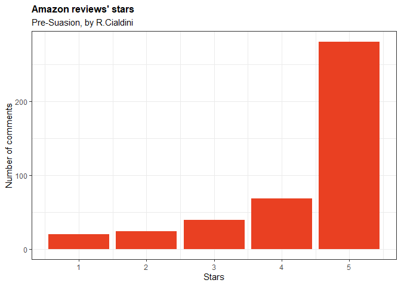<!-- -->

#### 4.c Three-stars bias verification

In this step, I verify what is the share of three-stars review, in order
to assess the weight of the possible bias introduced by a wrong
classification of them.

``` r
table %>% ggplot(aes(x = "", y = score, fill = as.character(score))) +
  geom_col(color = "white") +
  labs(title="Percentage distribution of stars")+
  coord_polar(theta = "y") +
  geom_text(aes(label = (scales::percent(p))),
            position = position_stack(vjust = 0.5)) +
  guides(fill = guide_legend(title = "Stars")) +
  scale_fill_manual(values = c("burlywood2", "orange", "darkorange2", "#F07F6A", "#ED5E45")) +
  theme_void()+
  theme(plot.title = element_text(size = 12,
                                  face = "bold"))
```

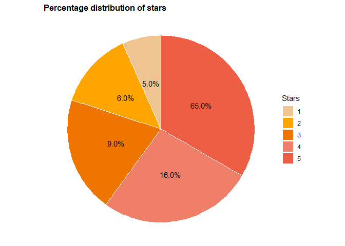<!-- -->

#### 4.d Sentiment classification

Positive: stars \>= 4

``` r
data=data %>% 
  mutate(star_sent=ifelse(score>=4,"positive","negative")) 
data %>% count(star_sent) %>%
  mutate(p=n/sum(n))
```

    ## # A tibble: 2 x 3
    ##   star_sent     n     p
    ##   <chr>     <int> <dbl>
    ## 1 negative     83 0.192
    ## 2 positive    349 0.808

#### 4.e Length comparison (positive/negative)

``` r
data_P = data %>% filter(star_sent == "positive") #positive
summary(str_length(data_P$text))
```

    ##    Min. 1st Qu.  Median    Mean 3rd Qu.    Max. 
    ##     9.0    57.0   131.0   336.8   264.0  6834.0

``` r
data_N = data %>% filter(star_sent == "negative") #negative
summary(str_length(data_N$text))
```

    ##    Min. 1st Qu.  Median    Mean 3rd Qu.    Max. 
    ##    16.0    84.0   195.0   375.7   419.0  5644.0

``` r
summary(str_length(data$text)) #general
```

    ##    Min. 1st Qu.  Median    Mean 3rd Qu.    Max. 
    ##     9.0    63.0   137.0   344.3   289.2  6834.0

``` r
data$nchar=str_length(data$text)
ggplot(data, aes(x=star_sent, y=nchar, fill=star_sent)) + 
  geom_boxplot() +
  theme_bw()+  
  scale_fill_manual(values=c("#e94022", "orange"))
```

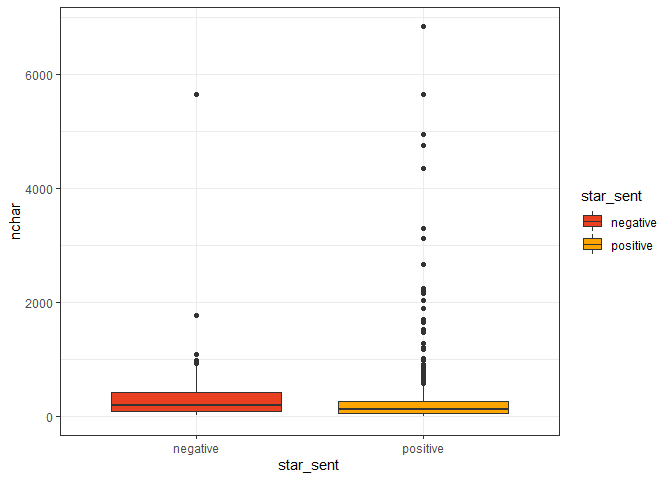<!-- -->

### 5. Tokenization

#### 5.a Tokens

``` r
tidy_text <- data %>%
  unnest_tokens(word, text) %>%
  anti_join(stop_words)
```

    ## Joining, by = "word"

``` r
tidy_text <- tidy_text %>% filter(
  !str_detect(word, "[[:digit:]]"))
```

#### 5.b Stems

``` r
tidy_stem <- tidy_text %>%
  mutate(word = wordStem(word))
```

#### 5.c Lemmas

``` r
tidy_lemma <- udpipe(data, "english-gum")
tidy_lemma = tidy_lemma %>%
  mutate(stem = wordStem(token)) %>%
  tibble()
```

### 6 Analysis on tokens

#### 6.a Word frequency

``` r
tidy_stem %>%
  count(word) %>%
  slice_max(n, n = 10) %>%
  mutate(word = reorder(word, n)) %>%
  ggplot(aes(word, n, fill = word)) + 
  geom_bar(stat = "identity", fill = "orange") +
  xlab(NULL) + 
  labs(title = "Most common stems in reviews",y = "Stems count") + 
  theme(legend.position = "none", plot.title = element_text(size = 12, face = "bold")) + 
  coord_flip() + 
  theme_bw()
```

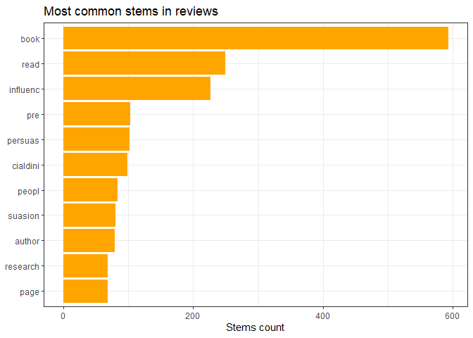<!-- -->

``` r
defaultW <- getOption("warn") 
options(warn = -1) 
tidy_stem %>%
  filter(word != "book") %>% 
  count(word) %>%
  with(wordcloud(scale = c(5, 0.7), word, n, max.words = 100,
                 min.freq = 2, random.order = F, rot.per = 0.15, colors = brewer.pal(8, "Paired")))
```

<!-- -->

``` r
options(warn = defaultW)
```

#### 6.b Frequency and sentiment

``` r
tidy_stem %>%
  group_by(star_sent) %>%
  count(word) %>%
  group_by(star_sent) %>%
  slice_max(n, n = 10, with_ties = F) %>%
  mutate(star_sent = as.factor(star_sent), word = reorder_within(word, n, star_sent)) %>%
  ggplot(aes(word, n, fill = star_sent)) + geom_col(show.legend = FALSE) +
  facet_wrap(~star_sent, scales = "free_y") + coord_flip() +
  labs(title = "Most common stems in positive/negative reviews",y = NULL, x = "N") + 
  scale_x_reordered() + 
  theme(legend.position = "none") +
  scale_fill_manual(values = c("#e94022", "orange")) + theme_bw()
```

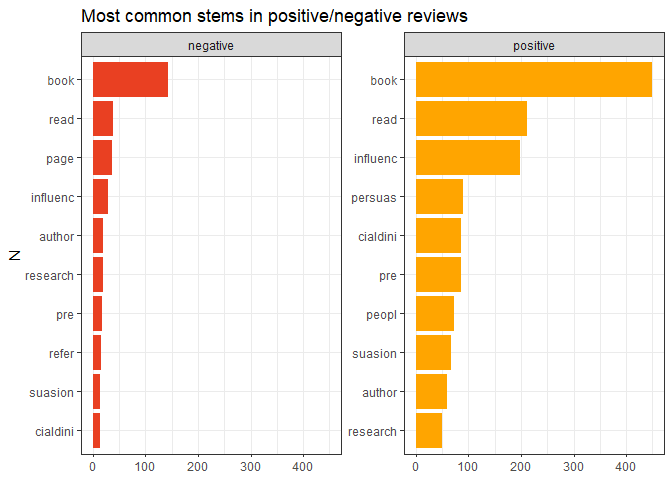<!-- -->

### 7. Bigrams

#### 7.a Most frequent words combination

``` r
tidy_big_stem <- data %>%
  unnest_tokens(bigram, text, token = "ngrams", n = 2) %>%
  separate(bigram, c("word1", "word2"), sep = " ") %>%
  filter(!word1 %in% stop_words$word) %>%
  filter(!word2 %in% stop_words$word) %>% 
  mutate(word1 = wordStem(word1)) %>%
  mutate(word2 = wordStem(word2))

tidy_big_stem <- tidy_big_stem %>% filter(
  !str_detect(word1, "[[:digit:]]"))

tidy_big_stem <- tidy_big_stem %>% filter(
  !str_detect(word2, "[[:digit:]]"))

bigram_counts = tidy_big_stem %>%
  count(word1, word2, sort = TRUE)


bigram_graph <- bigram_counts %>%
  filter(n >= 3) %>%
  graph_from_data_frame()


set.seed(9265)

a <- grid::arrow(type = "closed", length = unit(0.15, "inches"))

ggraph(bigram_graph, layout = "fr") + geom_edge_link(aes(edge_alpha = n),
                                                     show.legend = FALSE, arrow = a, end_cap = circle(0.07, "inches")) +
  geom_node_point(color = "orange", size = 5) + geom_node_text(aes(label = name),
                                                                vjust = 1, hjust = 1) + theme_void()
```

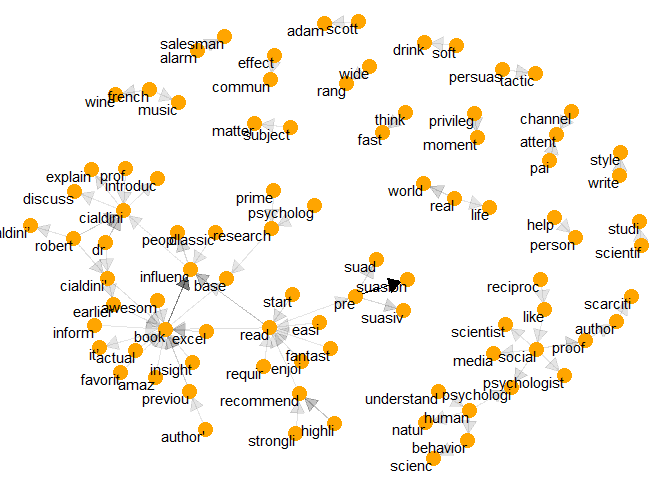<!-- -->

#### 7.b Check combination with “pre”

Given that one of the most used words is the prefix “pre” it is
interesting to check how people have used it.

``` r
tidy_big <- data %>% #Not used stem because we want to see complete words
  unnest_tokens(bigram, text, token = "ngrams", n = 2) %>%
  separate(bigram, c("word1", "word2"), sep = " ") %>%
  filter(word1 == "pre")%>% 
  filter(!word2 %in% stop_words$word) 

bigram_counts = tidy_big %>%
  count(word1, word2, sort = TRUE)


bigram_graph <- bigram_counts %>%
  filter(n >= 1) %>%
  graph_from_data_frame()


set.seed(9265)

a <- grid::arrow(type = "closed", length = unit(0.15, "inches"))

ggraph(bigram_graph, layout = "fr") + geom_edge_link(aes(edge_alpha = n),
                                                     show.legend = FALSE, arrow = a, end_cap = circle(0.07, "inches")) +
  geom_node_point(color = "orange", size = 5) + geom_node_text(aes(label = name),
                                                                vjust = 1, hjust = 1) + theme_void()
```

<!-- -->

#### 7.d Overview on cooccurrences

``` r
cooc <- cooccurrence(x = subset(tidy_lemma, upos %in% c("NOUN","ADJ")), term = "lemma", group = c("doc_id"))
head(cooc)
```

    ##    term1      term2 cooc
    ## 1   book       good  501
    ## 2   book     people  462
    ## 3   book  influence  410
    ## 4 author       book  409
    ## 5   book persuasion  378
    ## 6   book      other  327

``` r
wordnetwork <- head(cooc, 30)
wordnetwork <- graph_from_data_frame(wordnetwork)
ggraph(wordnetwork, layout = "fr") + geom_edge_link(aes(width = cooc,
    edge_alpha = cooc), edge_colour = "orange") + geom_node_text(aes(label = name),
    col = "black", size = 4) + theme(legend.position = "none") +
    theme_void() + labs(title = "Cooccurrences within documents",
    subtitle = "Nouns & Adjective")
```

<!-- -->

### 8. Tidy approach

#### 8.a Bing dictionary

``` r
bing = get_sentiments("bing")
data_bing = tidy_text %>%
  select(doc_id, word) %>%
  inner_join(bing) %>%
  count(doc_id, sentiment) %>%
  pivot_wider(names_from = sentiment, values_from = n, values_fill = 0) %>%
  mutate(bing = positive - negative)
```

    ## Joining, by = "word"

``` r
data = data %>%
    left_join(data_bing %>%
        select(doc_id, bing))
```

    ## Joining, by = "doc_id"

``` r
summary(data$bing)
```

    ##    Min. 1st Qu.  Median    Mean 3rd Qu.    Max.    NA's 
    ##  -6.000   1.000   1.000   1.495   2.000  20.000     119

``` r
hist(data$bing, col = "orange", main = "Sentiment distribution with bing")
```

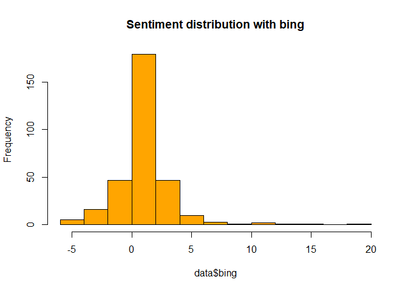<!-- -->

#### 8.b Comparison between Bing and Afinn sentiment distributions

``` r
afinn = get_sentiments("afinn")
data_afinn = tidy_text %>%
  select(doc_id, word) %>%
  inner_join(afinn) %>% group_by(doc_id) %>%
  summarise(afinn = sum(value))
```

    ## Joining, by = "word"

``` r
data = data %>%
    left_join(data_afinn %>%
        select(doc_id, afinn))
```

    ## Joining, by = "doc_id"

``` r
summary(data$afinn)
```

    ##    Min. 1st Qu.  Median    Mean 3rd Qu.    Max.    NA's 
    ##  -11.00    1.00    3.00    3.47    5.00   37.00     147

``` r
hist(data$afinn, col = "orange", main = "Sentiment distribution with afinn")
```

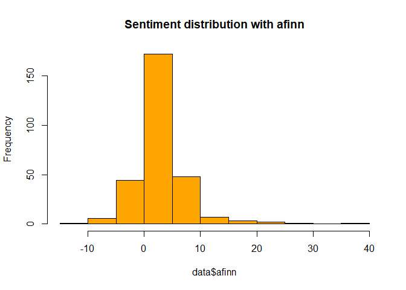<!-- -->

#### 8.c Contribution of words to the sentiment obtained with Bing

``` r
bing_word_counts <- tidy_text %>%
    inner_join(get_sentiments("bing")) %>%
    count(word, sentiment, sort = TRUE) %>%
    ungroup()
```

    ## Joining, by = "word"

``` r
bing_word_counts %>%
    group_by(sentiment) %>%
    slice_max(n, n = 5, with_ties = F) %>%
    ungroup() %>%
    mutate(word = reorder(word, n)) %>%
    ggplot(aes(n, word, fill = sentiment)) + geom_col(show.legend = FALSE) +
    facet_wrap(~sentiment, scales = "free_y") + labs(x = "Contribution to sentiment",
    y = NULL) + theme_bw() + scale_fill_manual(values = c("#e94022",
    "orange"))
```

<!-- -->

``` r
defaultW <- getOption("warn") 
options(warn = -1) 

tidy_text %>%
    inner_join(get_sentiments("bing")) %>%
    count(word, sentiment, sort = TRUE) %>%
    acast(word ~ sentiment, value.var = "n", fill = 0) %>%
    comparison.cloud(colors = c("#e94022", "orange"), max.words = 100)
```

    ## Joining, by = "word"

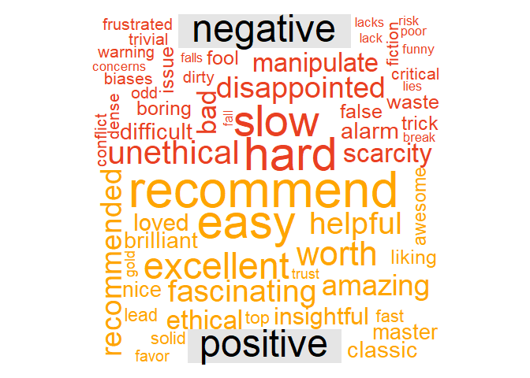<!-- -->

``` r
options(warn = defaultW)
```

#### 8.d Why unethical?

``` r
y = data.frame(cooc)
y = y %>% filter(term2 == "unethical")

wordnetwork <- head(y, 30)
wordnetwork <- graph_from_data_frame(wordnetwork)
ggraph(wordnetwork, layout = "fr") + geom_edge_link(aes(width = cooc,
                                                        edge_alpha = cooc), edge_colour = "#e94022") + geom_node_text(aes(label = name),
                                                                                                                     col = "black", size = 4) + theme(legend.position = "none") +
  theme_void() + labs(title = "Cooccurrences within documents",
                      subtitle = "Nouns & Adjective")
```

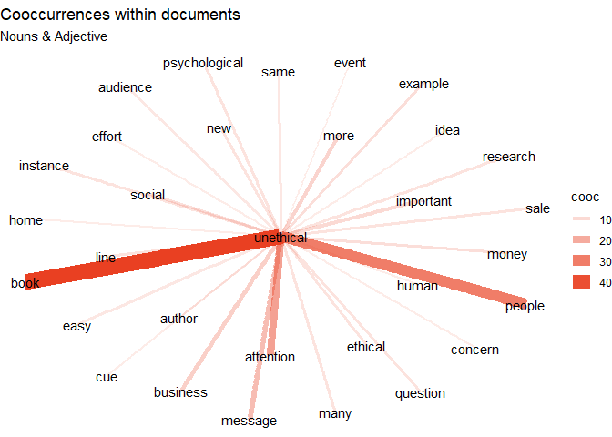<!-- -->

#### 8.e Verification of 3-stars sentiment using Bing dictionary

``` r
data_bing_3 = data %>%
  filter(score == 3)
m = round((data_bing_3$bing %>% mean(na.rm = T)), 2)
m
```

    ## [1] -0.19

``` r
hist(data_bing_3$bing, col = "orange", main = "Sentiment distribution for 3 stars reviews")
```

<!-- -->

#### 8.f Nrc dictionary

``` r
nrc = get_sentiments("nrc")
data_nrc = tidy_text %>%
  select(doc_id, word) %>%
  inner_join(nrc) %>% group_by(sentiment) %>% count() %>% arrange(desc(n))
```

    ## Joining, by = "word"

``` r
data_nrc %>% filter(sentiment != "positive" & sentiment != "negative") %>%
  ggplot(aes(x = reorder(sentiment,n), y = n, fill = sentiment), ) + 
  geom_col(show.legend = F)+
  coord_flip() +
  labs(title="Feelings about the book",
       subtitle = "Pre-Suasion, by R.Cialdini",
       x ="", 
       y = "")+
  theme_bw()+
  theme(plot.title = element_text(size = 12,
                                  face = "bold"))
```

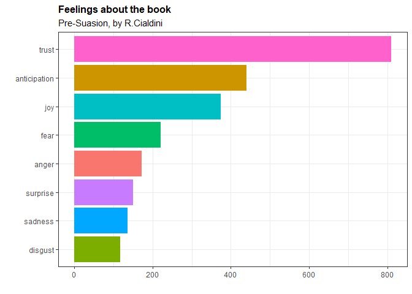<!-- -->

#### 8.g comparison

``` r
sent_bing = tidy_text %>%
  inner_join(bing, by="word") %>% 
  count(doc_id, sentiment) %>% 
  spread(sentiment, n, fill = 0) %>% 
  mutate(sentiment = positive-negative) %>% 
  select(doc_id, sentiment) %>% 
  mutate(method = "Bing")
```

``` r
sent_afinn = tidy_text %>%
  inner_join(afinn) %>% 
  group_by(doc_id) %>% 
  summarise(sentiment =sum(value)) %>% 
  mutate(method = "AFINN")
```

    ## Joining, by = "word"

``` r
sent_nrc = tidy_text %>%
  inner_join(nrc) %>% 
  filter(sentiment %in% c("positive", "negative")) %>%
  count(doc_id, sentiment) %>%
  spread(sentiment, n, fill=0) %>%
  mutate(sentiment = positive - negative, method = "nrc") %>%
  select(doc_id, sentiment, method)
```

    ## Joining, by = "word"

``` r
sent_all = bind_rows(sent_bing, 
                      sent_afinn, sent_nrc)

sent_all = sent_all %>%
  group_by(method) %>%
  mutate(sentiment.std = scale(sentiment)) %>%
  ungroup()

sent_all %>%
  group_by(method) %>%
  summarise(mean(sentiment.std), sd(sentiment.std), n()) %>%
  ungroup()
```

    ## # A tibble: 3 x 4
    ##   method `mean(sentiment.std)` `sd(sentiment.std)` `n()`
    ##   <chr>                  <dbl>               <dbl> <int>
    ## 1 AFINN              -4.82e-17                   1   285
    ## 2 Bing               -6.53e-17                   1   313
    ## 3 nrc                 8.75e-18                   1   341

``` r
sent_all %>% ggplot(aes(sentiment.std))+
  geom_histogram()+
  facet_wrap(~method)
```

    ## `stat_bin()` using `bins = 30`. Pick better value with `binwidth`.

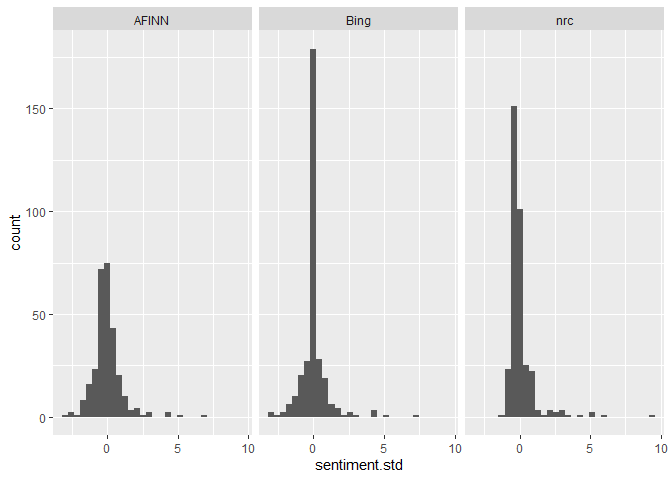<!-- -->

### 9. Udpipe approach

``` r
data_udpipe <- udpipe(data, "english-gum")

bing = get_sentiments("bing") %>% 
  mutate(sentiment=ifelse(sentiment == "negative",-1,+1))%>% 
  rename(term=word,polarity=sentiment)

scores <- txt_sentiment(x = data_udpipe, term = "lemma",
                        polarity_terms = bing,
                        polarity_negators = c("not", "neither", "no", "without"), 
                        polarity_amplifiers = c("very", "really", "definitely", "super", "highly", "strongly"),
                        polarity_deamplifiers = c("barely", "hardly"),
                        amplifier_weight = 0.8,
                        n_before = 2, 
                        n_after = 0, 
                        constrain = F)
data$udpipe = scores$overall$sentiment_polarity

summary(data$udpipe)
```

    ##    Min. 1st Qu.  Median    Mean 3rd Qu.    Max. 
    ##  -6.800   0.800   1.000   2.341   3.000  34.000

``` r
hist(data$udpipe, col = "orange", main = "Sentiment distribution - udpipe")
```

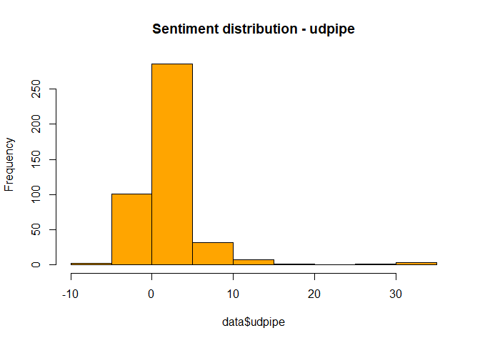<!-- -->

#### 9.a comparison between Bing and Udpipe sentiment distributions

``` r
datacomp = data %>%
  mutate(bing_pol=ifelse(bing>0, "positive",ifelse(bing==0, "neutral", "negative")),
         udpipe_pol=ifelse(udpipe>0,"positive",ifelse(udpipe==0,"neutral","negative")))

table(BING=datacomp$bing_pol,UDPIPE=datacomp$udpipe_pol)
```

    ##           UDPIPE
    ## BING       negative neutral positive
    ##   negative       22       7       12
    ##   neutral         4       5       18
    ##   positive        4      10      231

#### 9.b comparison between Bing and Udpipe sentiment classifications

``` r
par(mfrow = c(1, 2))
hist(scale(data$bing), col = "orange", main = "Sentiment distribution - bing")
hist(scale(data$udpipe), col = "orange", main = "Sentiment distribution - udpipe")
```

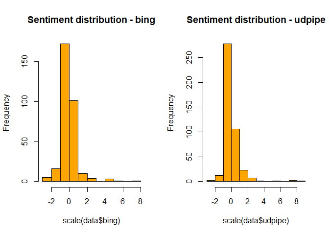<!-- -->

#### 9.c comparison between Bing, Stars and Udpipe sentiment classifications

``` r
data %>%
    select(doc_id, star_sent, udpipe, bing) %>%
    mutate(star_sent = ifelse(star_sent == "positive", 1, -1),
        udpipe = ifelse(udpipe > 0, 1, ifelse(udpipe < 0, -1,
            0)), bing = ifelse(bing > 0, 1, ifelse(bing < 0,
            -1, 0)), bing = replace_na(bing, 0)) %>%
    pivot_longer(cols = c("star_sent", "udpipe", "bing")) %>%
    ggplot(aes(doc_id, value, fill = name)) + geom_col(show.legend = FALSE) +
    facet_wrap(~name, ncol = 1, scales = "free_y", strip.position = "right") +
    theme_bw() + scale_fill_manual(values = c("orange",
    "#e94022", "orange"))
```

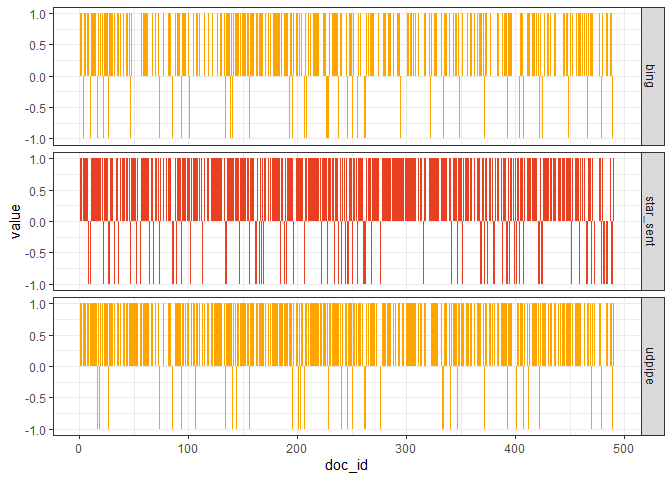<!-- -->
